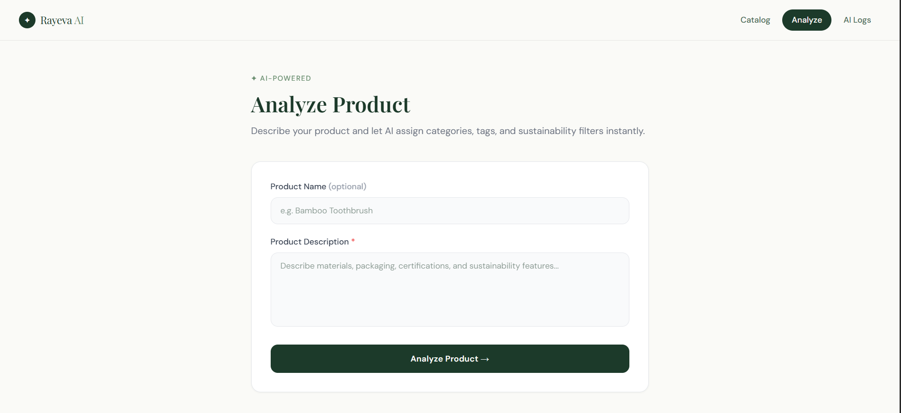
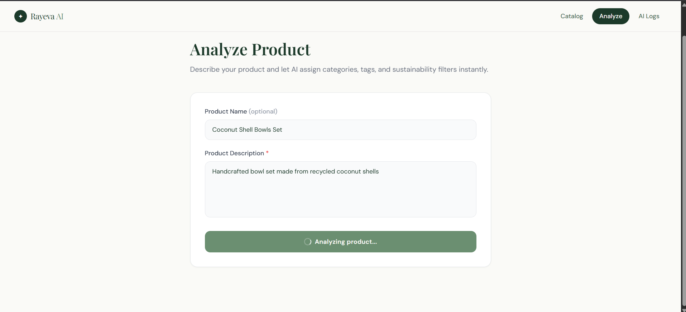
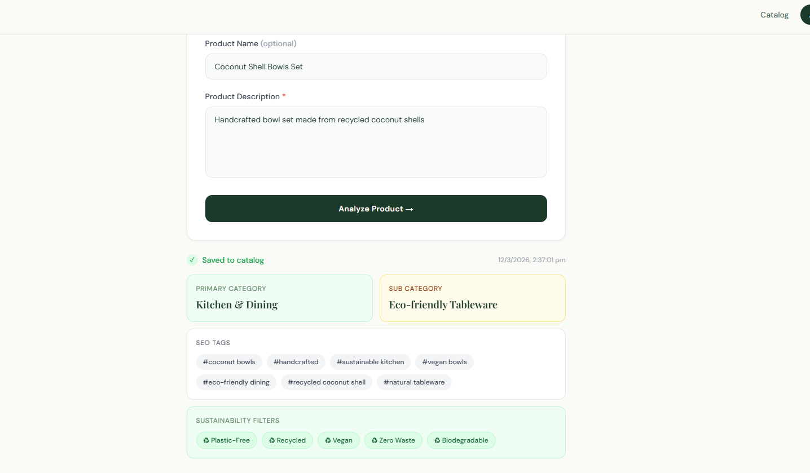
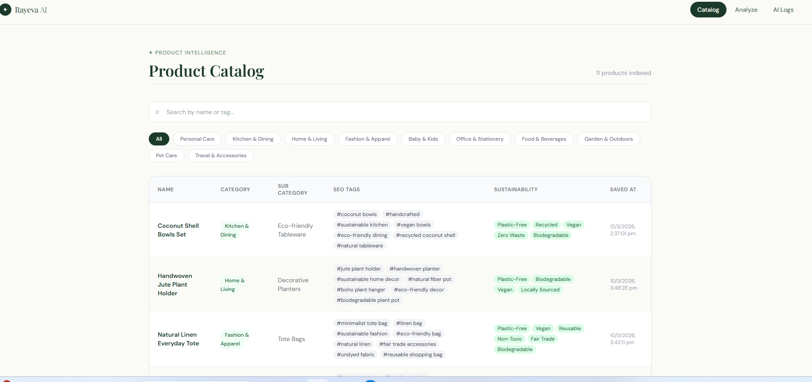
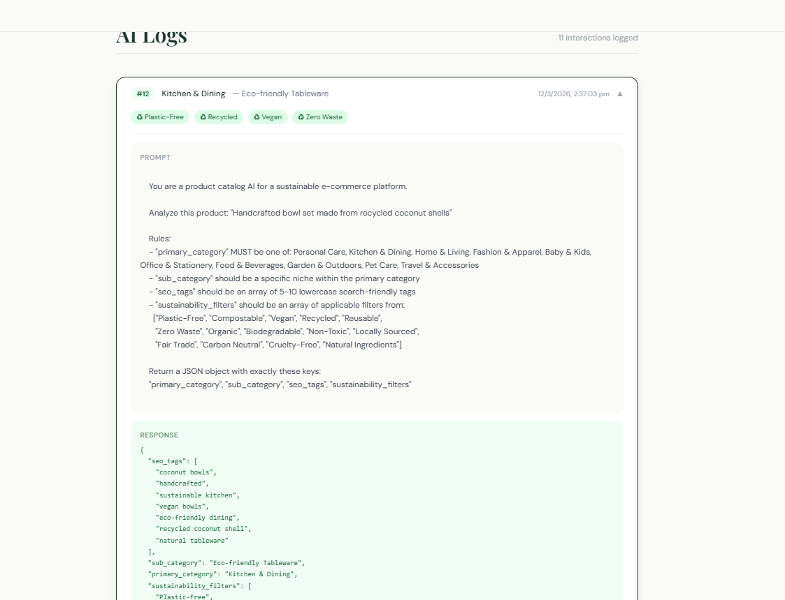

# Module 1 — AI Auto-Category & Tag Generator

> Part of the **Rayeva AI Systems Assignment** — Applied AI for Sustainable Commerce

**Live Demo:** [rayeva-ai-olive.vercel.app](https://rayeva-ai-olive.vercel.app)







---

## What It Does

When a vendor adds a product to Rayeva's catalog, this module automatically:

- Assigns a **primary category** from a predefined list of 10
- Suggests a **sub-category** specific to the product's niche
- Generates **5–10 SEO-friendly tags** for discoverability
- Applies relevant **sustainability filters** (e.g. Plastic-Free, Compostable, Vegan)
- Saves the full structured record to **Supabase**
- Logs every AI prompt and response for auditability

No manual tagging. No inconsistent categories. Just describe the product and the AI handles the rest.

---

## Tech Stack

| Layer | Technology |
|---|---|
| Backend | Node.js, Express |
| AI | Google Gemini (`gemini-3-flash-preview`) |
| Database | Supabase (PostgreSQL) |
| Frontend | React, Vite, Tailwind CSS |
| Hosting | Render (backend), Vercel (frontend) |

---

## Architecture

```
frontend (React + Tailwind)
    │
    │  POST /analyze { name, description }
    ▼
backend (Express)
    │
    ├── gemini.js       → builds prompt, calls Gemini API, parses JSON response
    ├── database.js     → saves product record to Supabase `products` table
    └── logger.js       → logs prompt + AI response to Supabase `ai_logs` table
```

### Request Flow

1. User submits product name + description from the frontend
2. Backend passes description to `analyzeProduct()` in `gemini.js`
3. Gemini returns structured JSON with category, sub-category, SEO tags, sustainability filters
4. Primary category is validated against the predefined list (fallback: "Home & Living")
5. Full product record is saved to the `products` table in Supabase
6. Prompt and response are logged to the `ai_logs` table
7. Result is returned to the frontend and displayed

---

## Database Schema

### `products`
| Column | Type | Description |
|---|---|---|
| id | bigint | Timestamp-based ID |
| name | text | Product name |
| description | text | Original input description |
| primary_category | text | AI-assigned category |
| sub_category | text | AI-suggested niche |
| seo_tags | text[] | 5–10 search tags |
| sustainability_filters | text[] | Applicable eco filters |
| created_at | text | IST timestamp |

### `ai_logs`
| Column | Type | Description |
|---|---|---|
| id | bigint | Auto-increment |
| product_id | bigint | FK → products.id |
| prompt | text | Exact prompt sent to Gemini |
| response | jsonb | Raw Gemini JSON response |
| created_at | text | IST timestamp |

---

## AI Prompt Design

### Approach

The prompt is designed around three principles:

**1. Constrained Output**
Gemini is instructed to return *only* a JSON object with exactly four keys. The `responseMimeType: "application/json"` generation config enforces this at the API level, eliminating the need to strip markdown code fences or handle plain text responses.

**2. Closed-Set Categories**
Rather than letting the AI freely invent categories (which leads to inconsistency at scale), the prompt injects the full predefined list of 10 primary categories and explicitly instructs Gemini to pick from that list only. A post-generation validation step catches any hallucinated categories and applies a safe fallback.

**3. Guided Filter Selection**
The sustainability filters are provided as an explicit allowlist of 14 options. This prevents vague or invented filters and ensures filters are actionable and consistent across the catalog.

### The Prompt

```
You are a product catalog AI for a sustainable e-commerce platform.

Analyze this product: "{description}"

Rules:
- "primary_category" MUST be one of: Personal Care, Kitchen & Dining, Home & Living,
  Fashion & Apparel, Baby & Kids, Office & Stationery, Food & Beverages,
  Garden & Outdoors, Pet Care, Travel & Accessories
- "sub_category" should be a specific niche within the primary category
- "seo_tags" should be an array of 5-10 lowercase search-friendly tags
- "sustainability_filters" should be an array of applicable filters from:
  ["Plastic-Free", "Compostable", "Vegan", "Recycled", "Reusable",
   "Zero Waste", "Organic", "Biodegradable", "Non-Toxic", "Locally Sourced",
   "Fair Trade", "Carbon Neutral", "Cruelty-Free", "Natural Ingredients"]

Return a JSON object with exactly these keys:
"primary_category", "sub_category", "seo_tags", "sustainability_filters"
```

### Why This Works

- Gemini receives clear, unambiguous rules — no room for creative interpretation on structure
- The product description is the only free variable, giving the model space to reason about the product's nature
- JSON mode (`responseMimeType: "application/json"`) makes parsing reliable and eliminates output wrapping issues
- The post-validation check on `primary_category` ensures data integrity even if the model drifts

---

## Project Structure

```
module1_ai_autocategory_tag_generator/
├── backend_module1/
│   ├── index.js        # Express server, /analyze route
│   ├── gemini.js       # Gemini API integration + prompt
│   ├── database.js     # Supabase read/write
│   ├── logger.js       # AI interaction logging
│   ├── supabase.js     # Supabase client
│   └── package.json
└── frontend_module1/
    ├── src/
    │   ├── pages/
    │   │   ├── Analyze.jsx   # Product input form + result display
    │   │   ├── Catalog.jsx   # Full product catalog with search + filter
    │   │   └── Logs.jsx      # AI logs viewer
    │   ├── components/
    │   │   └── Navbar.jsx
    │   └── App.jsx
    └── package.json
```

---

## Environment Variables

### Backend
```env
GEMINI_API_KEY=your_gemini_api_key
SUPABASE_URL=your_supabase_project_url
SUPABASE_KEY=your_supabase_anon_key
FRONTEND_URL=http://localhost:5173
```

### Frontend
```env
VITE_API_URL=http://localhost:3000
VITE_SUPABASE_URL=your_supabase_project_url
VITE_SUPABASE_KEY=your_supabase_anon_key
```

---

## Running Locally

```bash
# Backend
cd backend_module1
npm install
node index.js

# Frontend
cd frontend_module1
npm install
npm run dev
```